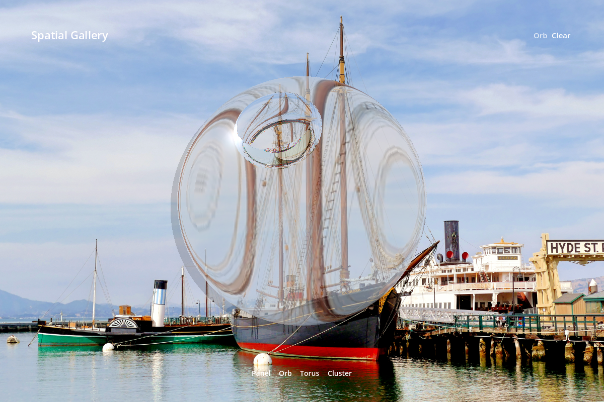

# Volumetric Liquid Glass for Godot

**Ray-marched glass objects you can put inside a Godot scene** — a panel, an
orb, a torus or a cluster, refracting whatever your app has already drawn.

[](https://github.com/1234igor/volumetric-liquid-glass/actions/workflows/check.yml)
[](https://godotengine.org)
[](LICENSE)
[](project.godot)



Apple's Liquid Glass is a flat surface effect. This is the same optical idea
given a third dimension: the shader traces both the entry and the exit
interface of a solid, and applies Snell refraction, restrained RGB dispersion,
thickness absorption, transmissive dye, Fresnel reflection, specular response,
internal caustics and elevation shadowing to your application's framebuffer.

A conservative analytic bound rejects rays that cannot touch the selected volume
before the more expensive entry and shadow traces run, so the cost tracks the
object's silhouette rather than the window.

If you want the flat version, it lives in
[godot-liquid-glass](https://github.com/1234igor/godot-liquid-glass).

## Try it

```sh
git clone https://github.com/1234igor/volumetric-liquid-glass
godot --path volumetric-liquid-glass
```

The default scene is a spatial gallery: choose **Panel**, **Orb**, **Torus** or
**Cluster** from the bottom bar, cycle the material from the header, drag to
orbit and scroll to dolly.

## Use it

Copy [`addons/volumetric_liquid_glass/`](addons/volumetric_liquid_glass/) into a
Godot 4.7 project. Add your world or media content **first**, then create the
glass layer above it:

```gdscript
var glass := VolumetricGlassLayer.new()
add_child(glass)

glass.set_object_type(VolumetricGlassLayer.ObjectType.ORB)
glass.set_material_style(VolumetricGlassLayer.MaterialStyle.CLEAR)
glass.set_view_preset(VolumetricGlassLayer.ViewPreset.THREE_QUARTER)
glass.animation_enabled = true
glass.interaction_enabled = true
```

`VolumetricGlassLayer` fills its parent viewport and creates the
`BackBufferCopy` the optical pass needs. Put normal application controls *after*
the layer, so labels and buttons stay crisp and clickable.

Animation and pointer capture are **off by default**: a static glass object
should stay idle, and a full-viewport layer should not swallow your UI. Turn
either on when the scene actually wants it. Identity disables capture, optical
drawing, animation and input together.

### The flat compatibility projection

Panel + Side is the projection that is pixel-matched against SwiftUI. Configure
its bounds and add content above the material through the content host:

```gdscript
glass.side_glass_rect = Rect2(380.0, 602.0, 440.0, 96.0)
var title := Label.new()
title.text = "Now Playing"
title.position = Vector2(88.0, 24.0)
glass.get_side_content_layer().add_child(title)
```

The content host stays visible under Identity, matching SwiftUI: the material
disappears without taking the control's label or icon with it.

### The public surface

- Four analytic objects: rounded panel, dimpled orb, torus, smooth cluster.
- Four camera presets: Side, Three Quarter, Grazing, Top.
- Five materials: Regular, Clear, both tinted modes, and exact Identity.
- Opt-in pointer orbit, wheel dolly, and `set_interaction_energy()`.
- Independent object, camera, material, warmth and animated-phase uniforms.

## Composition order

1. Draw the world, photo, video or editor canvas.
2. Add `VolumetricGlassLayer`, which captures that finished background.
3. Configure the object and material from application state.
4. Add toolbars and actionable controls afterwards.

[`examples/spatial_gallery/`](examples/spatial_gallery/) follows exactly this
order and keeps its object selection and material command outside the optical
pass.

## How close is the flat projection?

The Panel + Side projection is captured beside a real SwiftUI `.glassEffect`
built with Xcode, over four deliberately hostile backgrounds, and compared pixel
by pixel. Measured on macOS 27 with Godot 4.7.1, 20 pairs at 2400 × 1600:

| Metric | Range across the matrix |
|--------|------------------------|
| Glass-region similarity, the four materials | 93.80 – 97.73 % |
| Glass-region similarity, Identity | 98.81 – 99.52 % |
| Whole-window similarity | 99.42 – 99.94 % |

**Known gap.** The optics were calibrated against macOS 26. On macOS 27 Apple
moved the Regular material slightly, and Regular now measures 93.80 – 96.48 %
against a 95 % acceptance gate the other materials still clear — so
`validation/tools/full-visual.sh` reports a failure on Regular out of the box.
The gate has been left where it is rather than lowered to make the run green.
Clear, both tinted materials and Identity are unaffected.

The volumetric objects have no native counterpart to match, so they are gated on
coverage instead: each material must change a measured share of the pixels
inside the object, and Identity must change exactly zero.

Everything is in [`validation/`](validation/README.md) and reproducible.

## Layout

| Path | What lives there |
|------|------------------|
| [`addons/volumetric_liquid_glass/`](addons/volumetric_liquid_glass/) | The reusable layer and its optical shaders — the part you copy |
| [`examples/spatial_gallery/`](examples/spatial_gallery/) | Integration example and default scene |
| [`validation/`](validation/) | SwiftUI reference app, capture tools, comparison, evidence |
| [`assets/`](assets/BACKGROUNDS.md) | The four stress backgrounds and where they came from |

## Requirements

- Godot 4.7, GL Compatibility renderer
- macOS only for `validation/` — the SwiftUI reference needs macOS 26 or newer
  and a matching Xcode. The addon itself has no macOS-specific code.

## Licence

[MIT](LICENSE). Use it in commercial work, including paid App Store apps,
without asking. See [THIRD-PARTY.md](THIRD-PARTY.md) for the bundled assets.

"Liquid Glass" is Apple's name for its own design language. This project is an
independent reimplementation for Godot, is not affiliated with or endorsed by
Apple, and ships none of Apple's code or assets.
