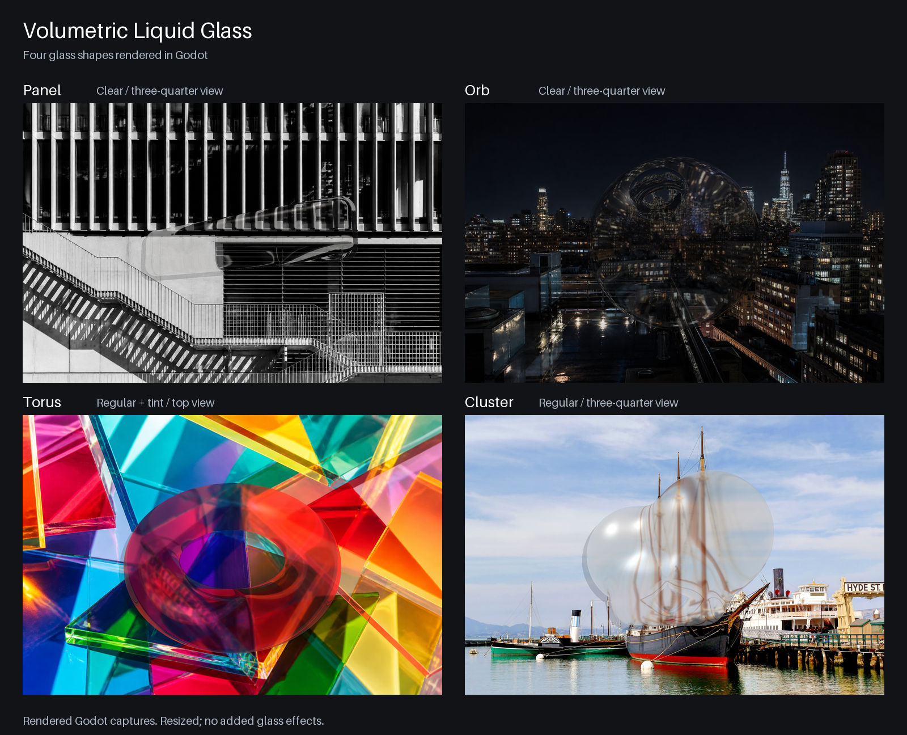

# Volumetric Liquid Glass for Godot

Four glass shapes for Godot: a panel, an orb, a torus, and a cluster. Each bends the scene behind it as you change its material or viewing angle.



[Image credits and licenses](IMAGE-LICENSES.md): Bernard Spragg (CC0) and project-generated backgrounds (MIT).

These are captures from the Godot renderer. See [all materials](validation/captures/volume-material-matrix.png) and [camera views](validation/captures/view-projections.png).

## Run

Requires Godot 4.7 with the GL Compatibility renderer.

```sh
git clone https://github.com/1234igor/volumetric-liquid-glass
godot --path volumetric-liquid-glass
```

Choose a shape from the bottom bar. Click the material name to cycle styles. Drag to orbit; scroll to zoom.

## Add glass to a scene

Copy [`addons/volumetric_liquid_glass/`](addons/volumetric_liquid_glass/) into your project. Add the layer after the background and before your controls:

```gdscript
var glass := VolumetricGlassLayer.new()
add_child(glass)
glass.set_object_type(VolumetricGlassLayer.ObjectType.ORB)
glass.set_material_style(VolumetricGlassLayer.MaterialStyle.CLEAR)
glass.set_view_preset(VolumetricGlassLayer.ViewPreset.THREE_QUARTER)
glass.animation_enabled = true
glass.interaction_enabled = true
```

The layer fills the viewport. Animation and pointer input are off by default.

| Setting | Choices |
| --- | --- |
| Shape | Panel, Orb, Torus, Cluster |
| Material | Regular, Clear, Regular Tinted, Clear Tinted, Identity |
| Camera | Side, Three Quarter, Grazing, Top |

Identity turns off the glass, capture, animation, and input. Labels remain visible.

Panel with the Side camera uses a flat glass panel. Set `side_glass_rect` to place it, and add labels to `get_side_content_layer()`. Other views use the volume shader, which traces light through the object's front and back surfaces.

## Validation

The volume shapes have no native Apple equivalent. Their checks cover visible output, distinct views, and Identity. The flat panel has a SwiftUI comparison, but its Regular material still fails the stored macOS 27 checks. It is an approximation.

[Validation and image generation](validation/README.md) contains the commands and results. A high average pixel-error score alone does not establish visual fidelity.

[MIT license](LICENSE). See [third-party notices](THIRD-PARTY.md) for the photographs. This project is independent of Apple.
